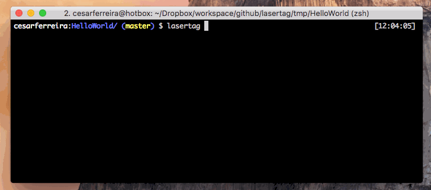
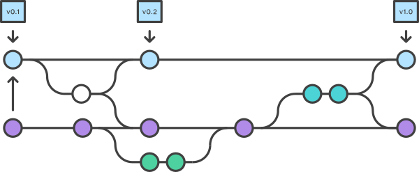

# Lasertag


[](https://badge.fury.io/rb/lasertag) 
[

> Like most VCSs, Git has the ability to tag specific points in history as being important. Typically people use this functionality to mark release points (v1.0.0, and so on)

<!-- Match your CVS tags with your android versions with laser speed! -->

<p align="center">

</p>


## Usage

This will extract the android's app module `version` and create a matching `git tag`.

    $ lasertag --module [module_name]


<b>A bit more complex usage:</b>

```bash
$ lasertag --path ~/Project --module app --flavor prod --remote origin
```

## Handy in

Pretty handy in situations like the most used git workflow, the [Gitflow Workflow](https://www.atlassian.com/git/tutorials/comparing-workflows/gitflow-workflow), a strict branching model designed around the project release:

<p align="center">

</p>

## Full usage
```bash

Usage: lasertag [OPTIONS]

Options
  -m, --module MODULE    # Specifies the app module
  -f, --flavor FLAVOR    # Specifies the flavor (e.g. dev, qa, prod)
  -p, --path PATH        # Custom path to android project
  -d, --dont-push        # Only tags the code, doesn't push it upstream
  -r, --remote REMOTE    # Custom remote to your project (default: "origin")
  -h, --help             # Displays help
  -v, --version          # Displays version

```

## Installation

    $ gem install lasertag

## Ubuntu

This tool requires a working Gradle distribution and currently does not make use of the Gradle wrapper bundled with the Android project. To install Gradle,

    apt-get install gradle

This applies for other linux distros as well.

## Under the hood

- Tries to compile the project
- Find out the package and the app version
- executes git tag -a v[tag_version] -m "tag [tag_name]"
- executes git push origin [tag_name]

Whenever a step fails, it stops the whole process and rolls it back.

## License

The gem is available as open source under the terms of the [MIT License](http://opensource.org/licenses/MIT).

